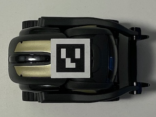
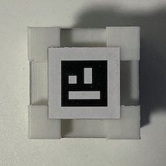
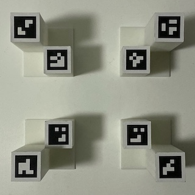
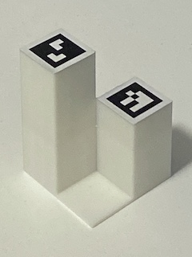

# Pose Estimation with ArUco Markers

This directory contains code for setting up a pose estimation server. Using an overhead camera, we detect ArUco markers installed to robots and cubes in the environment to get real-time 2D poses with millimeter-level precision.

## Camera Setup

Please see the main [`README.md`](../README.md) for requirements that should be installed via `pip`.

We use a [Logitech C930e webcam](https://www.amazon.com/Logitech-C930e-1080P-Video-Webcam/dp/B00CRJWW2G) as our overhead camera. While other cameras may work too, our setup is based on this particular camera. If you are using other cameras, the size of the environment may need to be modified to ensure reliable marker detection, especially if the camera FOV is low (the C930e has 90-degree FOV) or the camera image quality is worse. Also note that while the C930e supports 1080p, we run it at 720p. We found that when using 1080p, the latency would be too large, causing the robot controller to overshoot.

---

The code uses the serial number of your camera to use as an identifier when saving and loading camera parameters. If it cannot get the serial number, the default identifier of `'unknown-camera'` is used. You can run the following command (in this directory) to check whether it can find your camera's serial number, replacing `logitech-c930e` with your camera's name:

```bash
python -c "import utils; print(utils.get_camera_identifier('logitech-c930e'))"
```

If you are using a camera that is not the C930e, you can modify `get_usb_device_serial` in `utils.py` to add your camera.

Additionally, on Ubuntu 18, the following steps may be necessary to enable `pyusb` to access your camera's serial number. Be sure to change the `idVendor` and `idProduct` attributes in `99-webcam.rules` to match those of your camera.

```bash
sudo cp 99-webcam.rules /etc/udev/rules.d/99-webcam.rules
sudo udevadm control --reload-rules
sudo service udev restart
sudo udevadm trigger
```

## Camera Calibration

The camera needs to be calibrated for accurate marker detection. We use the ChArUco board to calibrate our camera. You can generate a printable ChArUco board using the following command, which output a PDF file to [`printouts/charuco-board.pdf`](printouts/charuco-board.pdf).

```bash
python create_charuco_board.py
```

After printing, be sure to check that the squares are actually 24 mm wide, as some printers will rescale the document before printing.

---

To do the calibration, we provide a calibration script based on the [official example](https://github.com/opencv/opencv_contrib/blob/master/modules/aruco/samples/calibrate_camera_charuco.cpp). Run the following command, with additional arguments if you are not using the C930e camera. Try to cover a wide variety of viewpoints. The board should also be kept as flat as possible (by using a clipboard, for example).

```
python calibrate_charuco.py
```

After calibration, the computed camera parameters will be written to a config file located at `camera-params/your-camera-identifier.yml`.

For more information on camera calibration with ChArUco boards, please see the [official tutorial](https://docs.opencv.org/4.1.2/da/d13/tutorial_aruco_calibration.html).

## Marker Installation

To create printable markers for the robots, cubes, and board corners, run the following command, which will generate several printable marker sheets in [`printouts`](printouts).

```
python create_markers.py
```

We printed the markers on [label paper](https://www.amazon.com/AmazonBasics-Address-Labels-Inkjet-Printers/dp/B074KQRJKN), allowing us to cut the markers out and easily install them. As with the ChArUco board, be sure to measure the printed markers in case the printer rescaled the document. The markers should be 18 mm wide.

---

The `detect_markers.py` script will detect markers visible in the camera image, and is useful for verifying marker IDs and marker orientations. To use it, run the following command:

```bash
python detect_markers.py
```

### Robot Markers

Since marker detection works best when the markers are installed on a flat surface, we added an [acrylic square](https://www.amazon.com/1-5mm-Clear-Miniature-Bases-Square/dp/B00MNMRFEW) for the robot markers. Marker IDs 0 through 9 are used for the robots. See photos below for placement on the robot. The markers should be parallel to the horizontal plane.

 | 
:---: | :---:

### Cube Markers

Marker IDs 10 through 33 are used for the cubes. See photo below for placement. For each cube, we installed the same marker to all six sides.


:---:

### Corner Markers

The board corner markers are used as anchors for the corners of the room in image space. There are two sets of board corner markers, one for the cubes at height 44 mm, and one for the robots at height 70 mm. By computing the positions of the robot and cube markers in image space relative to the board corners, we can determine the 2D poses of the robots and cubes. Marker IDs 42 through 45 are used for the robot board corners, and 46 through 49 for the cube board corners. See photos below for placement.

 | 
:---: | :---:

## Board Setup

For setting up the rest of the environment, please reference the photos and videos of the setup on the [project page](https://spatial-action-maps.cs.princeton.edu).

Note that the camera must be close enough to reliably detect all 8 board corner markers. We placed our camera approximately 74.5 cm above the board.
It is very important that all 8 board corner markers are reliably detected. Without accurate estimates of the board corners to anchor on, all pose estimates will be off.

You can use the `detect_markers.py` script from before to check whether all of the board corners are detected:

```bash
python detect_markers.py
```

## Pose Estimation

Once the board setup is complete, you can run the following command to start the pose estimation server:

```bash
python server.py
```

Note that the server will not start running until a client connects. We provide `simple_client.py`, which you can use to make sure the server is outputting poses:

```bash
python simple_client.py
```

If no pose estimates are showing up in the client, the `--debug` flag can passed to the server to show visualizations of the marker detections:

```bash
python server.py --debug
```

At this point, if the client is showing reasonable pose estimates, then the pose estimation server should be ready for use with the rest of the robot setup. Please see the main [`README.md`](../README.md) for further details.
